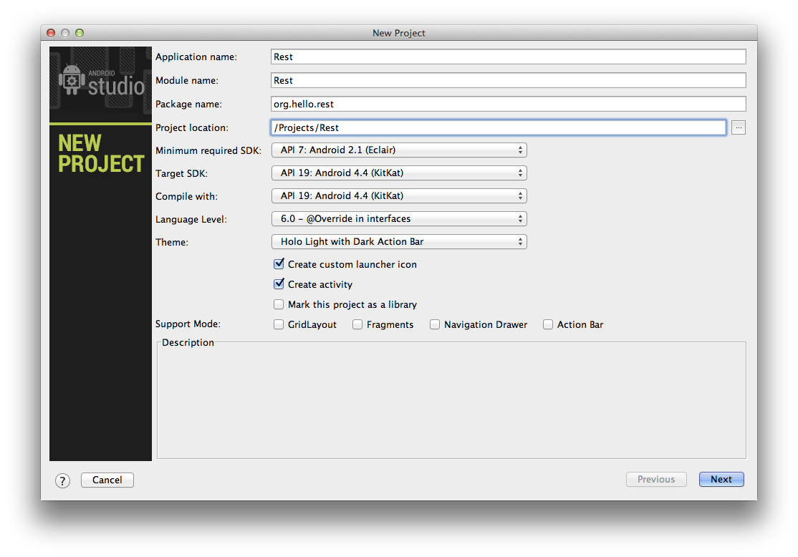
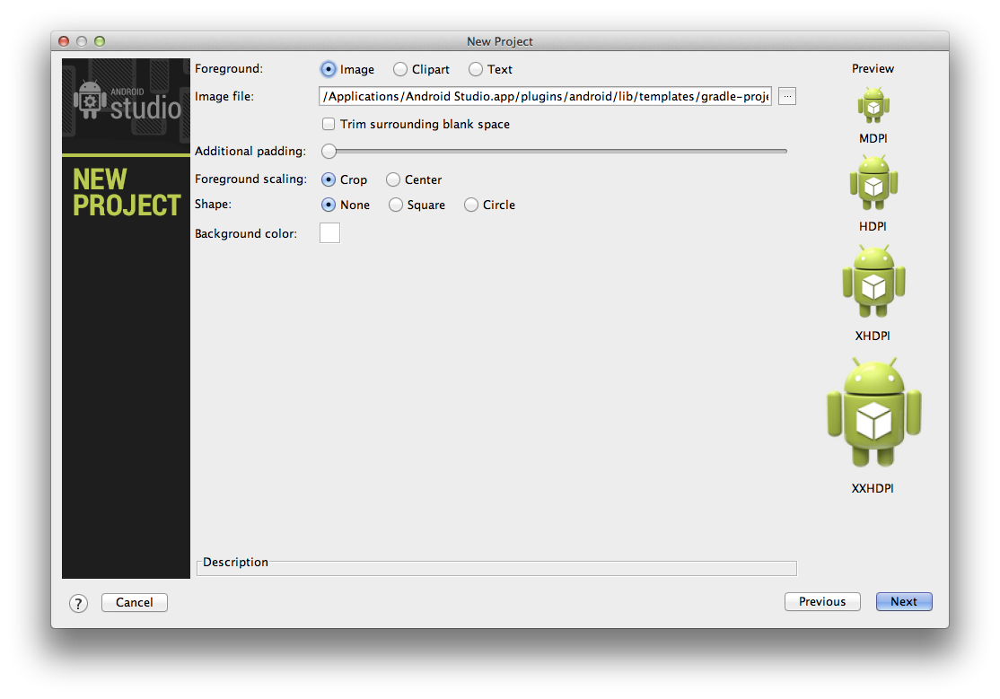
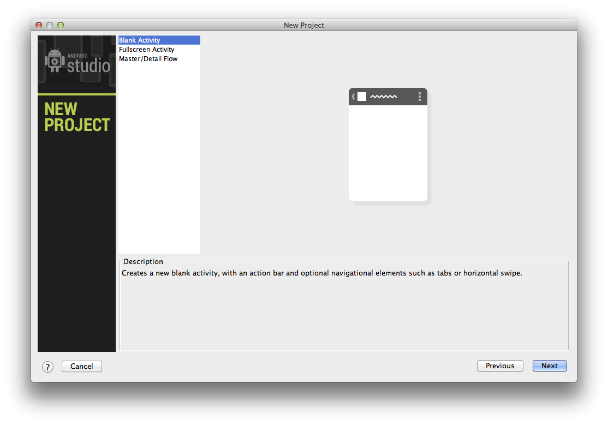
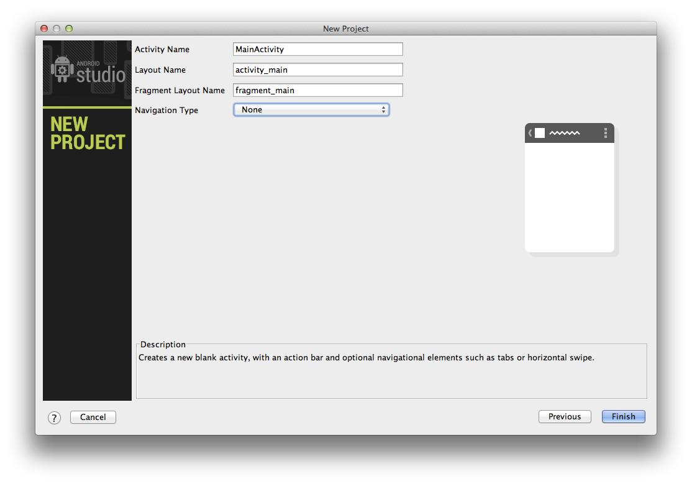
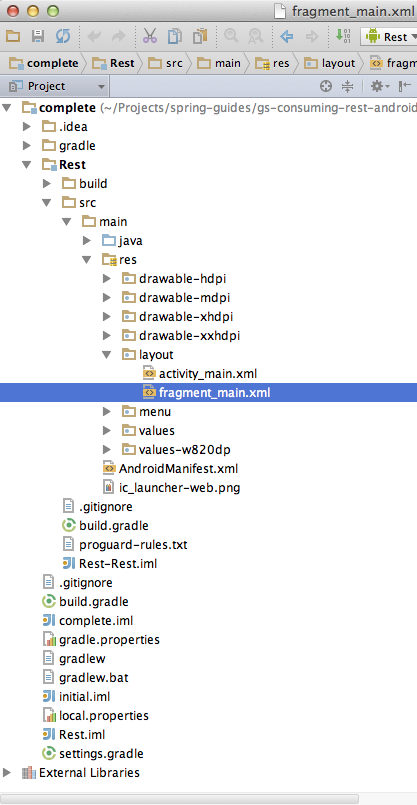
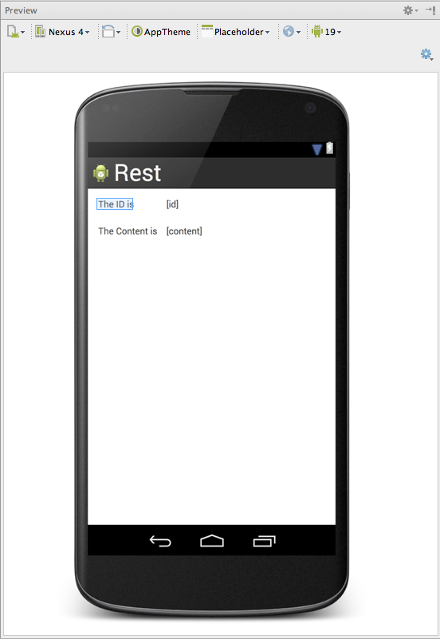
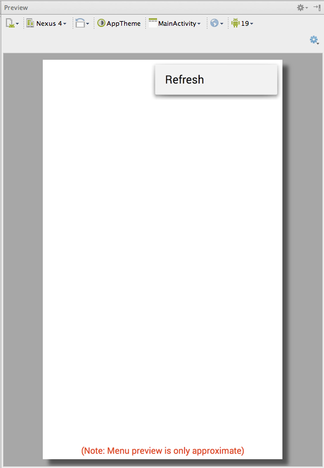

This Getting Started guide walks you through the process of building an application that uses Spring for Android's `RestTemplate` to consume a Spring MVC-based [RESTful web service][u-rest].

What you will build
-------------------

You will build an Android client that consumes a Spring-based RESTful web service. Specifically, the client will consume the service created in [Building a RESTful Web Servce][gs-rest-service].

The Android client will be accessed through an Android emulator, and will consume the service accepting requests at:

    http://rest-service.guides.spring.io/greeting

The service will respond with a [JSON][u-json] representation of a greeting:

```json
{"id":1,"content":"Hello, World!"}
```

The Android client will render the ID and content into a view.


What you will need
------------------

 - About 15 minutes
 - [Android Studio]
 - An internet connection


Set up the project
------------------

Within Android Studio, create a new project. Use "Rest" for the application and module names, and modify the package name to be "org.hello.rest". Enter the location of your choosing for the project and leave all the other options with their default settings.



The next screen presents some options for configuring the app icons. Continue with the default options.



The next screen presents an option to select the type of activity to use. Select "Blank Activity" and continue.



The last screen presents some fields for setting the activity, layout, and fragment names. Again, continue with the default options to finish the project setup.



When the project is created, you will see that several files are added. To complete this guide, you will edit the following:

 - `Rest/src/main/AndroidManifest.xml`
 - `Rest/src/main/res/values/strings.xml`
 - `Rest/src/main/res/layout/fragment_main.xml`
 - `Rest/src/main/res/menu/main.xml`
 - `Rest/build.gradle`
 - `Rest/src/main/java/org/hello/rest/MainActivity.java`




Create an Android Manifest
--------------------------

The [Android Manifest] contains all the information required to run an Android application, and it cannot build without one. The manifest also contains any permissions for which the app is requesting of the Android operating system. In this case, the app needs to access the internet to make an HTTP request. Add the following permission so the application can access resources over the internet.

```XML
<uses-permission android:name="android.permission.INTERNET" />
```

After you add the permission, the updated manifest should look similar to this:

`Rest/src/main/AndroidManifest.xml`
```xml
<?xml version="1.0" encoding="utf-8"?>
<manifest xmlns:android="http://schemas.android.com/apk/res/android"
    package="org.hello.rest"
    android:versionCode="1"
    android:versionName="1.0">

    <uses-sdk
        android:minSdkVersion="7"
        android:targetSdkVersion="19" />

    <uses-permission android:name="android.permission.INTERNET" />

    <application
        android:allowBackup="true"
        android:icon="@drawable/ic_launcher"
        android:label="@string/app_name"
        android:theme="@style/AppTheme">
        <activity
            android:name="org.hello.rest.MainActivity"
            android:label="@string/app_name">
            <intent-filter>
                <action android:name="android.intent.action.MAIN" />

                <category android:name="android.intent.category.LAUNCHER" />
            </intent-filter>
        </activity>
    </application>

</manifest>
```


Create string resources
-----------------------

Add a text string for each UI widget. Text strings can be referenced from the application or from other resource files. This guide uses four text views and a menu item, and each of these UI elements needs a text description. Add `id_label`, `id_value`, `content_label`, `content_value` and `action_refresh` strings.

`Rest/src/main/res/values/strings.xml`
```xml
<?xml version="1.0" encoding="utf-8"?>
<resources>

    <string name="app_name">Rest</string>
    <string name="id_label">The ID is</string>
    <string name="id_value">[id]</string>
    <string name="content_label">The Content is</string>
    <string name="content_value">[content]</string>
    <string name="action_refresh">Refresh</string>

</resources>
```


Create a layout
---------------

The layout file is where you define the visual structure for the user interface of your application. When you created the project, Android Studio added a layout fragment. As the name implies, a layout fragment represents a piece of the overall layout. In this case the layout fragment is used to display some text within the main activity. Modify the layout fragment to include four `TextView` widgets. The ids are used to reference these widgets from the code. Note the use of the string resources for the text of each widget.

`Rest/src/main/res/layout/fragment_main.xml`
```xml
<RelativeLayout xmlns:android="http://schemas.android.com/apk/res/android"
    xmlns:tools="http://schemas.android.com/tools"
    android:layout_width="match_parent"
    android:layout_height="match_parent"
    android:paddingLeft="@dimen/activity_horizontal_margin"
    android:paddingRight="@dimen/activity_horizontal_margin"
    android:paddingTop="@dimen/activity_vertical_margin"
    android:paddingBottom="@dimen/activity_vertical_margin"
    tools:context=".MainActivity$PlaceholderFragment">

    <TextView
        android:id="@+id/id_label"
        android:text="@string/id_label"
        android:layout_width="wrap_content"
        android:layout_height="wrap_content" />

    <TextView
        android:id="@+id/content_label"
        android:text="@string/content_label"
        android:layout_width="wrap_content"
        android:layout_height="wrap_content"
        android:layout_marginTop="25dp"
        android:layout_below="@+id/id_label"
        android:layout_alignParentLeft="true" />

    <TextView
        android:id="@+id/id_value"
        android:text="@string/id_value"
        android:layout_width="wrap_content"
        android:layout_height="wrap_content"
        android:layout_alignParentTop="true"
        android:layout_toRightOf="@+id/id_label"
        android:layout_marginLeft="50dp" />

    <TextView
        android:id="@+id/content_value"
        android:text="@string/content_value"
        android:layout_width="wrap_content"
        android:layout_height="wrap_content"
        android:layout_alignTop="@+id/content_label"
        android:layout_alignLeft="@+id/id_value" />

</RelativeLayout>
```
    
The layout includes some information about how to position and size the widgets. Android Studio will display the visual representation of the layout in the preview window:




Create a menu
-------------

The project includes a menu for the main activity. Modify the menu to have a "refresh" option. Note again the use of the string resource as the title of the menu item.

`Rest/src/main/res/menu/main.xml`
```xml
<menu xmlns:android="http://schemas.android.com/apk/res/android"
    xmlns:app="http://schemas.android.com/apk/res-auto"
    xmlns:tools="http://schemas.android.com/tools"
    tools:context=".MainActivity" >
    
    <item android:id="@+id/action_refresh"
        android:title="@string/action_refresh"
        android:orderInCategory="100"
        app:showAsAction="never" />
</menu>
```
    
Android Studio will display the visual representation of the menu in the preview window:




Create a representation class
-----------------------------

To model the JSON data received from the RESTful HTTP request, you create a representation class that defines the fields.

`Rest/src/main/java/org/hello/rest/Greeting.java`
```java
package org.hello.rest;

public class Greeting {

    private String id;
    private String content;

    public String getId() {
        return this.id;
    }

    public String getcontent() {
        return this.content;
    }

}
```

As you can see, this is a simple Java class with a handful of properties and matching getter methods.


Add dependencies
----------------

To utilize Spring for Android's RestTemplate within an Android app, you need to add the required Maven dependencies to the Gradle build file. RestTemplate makes use of Jackson, which is a powerful JSON processor for Java.

`Rest/build.gradle`
```gradle
buildscript {
    repositories {
        mavenCentral()
    }
    dependencies {
        classpath 'com.android.tools.build:gradle:0.6.+'
    }
}
apply plugin: 'android'

repositories {
    mavenCentral()
}

android {
    compileSdkVersion 19
    buildToolsVersion "19.0.0"

    defaultConfig {
        minSdkVersion 7
        targetSdkVersion 19
    }
    buildTypes {
        release {
            runProguard true
            proguardFile getDefaultProguardFile('proguard-android-optimize.txt')
        }
    }
    productFlavors {
        defaultFlavor {
            proguardFile 'proguard-rules.txt'
        }
    }
}

dependencies {
    compile 'com.android.support:appcompat-v7:+'
    compile 'org.springframework.android:spring-android-rest-template:1.0.1.RELEASE'
    compile 'com.fasterxml.jackson.core:jackson-databind:2.3.0'
}
```


Create an activity
------------------

The Model-View-Controller design pattern (MVC) is used extensively in Android applications. An `Activity` controls the view, which is represented by the layout you already created. When you created the project, a `MainActivity` was also created with a default implementation. Modify the `MainActivity` to make a RESTful HTTP request and update the view. Each modification is explained below.

`Rest/src/main/java/org/hello/rest/MainActivity.java`
```java
package org.hello.rest;

import android.os.AsyncTask;
import android.os.Bundle;
import android.support.v4.app.Fragment;
import android.support.v7.app.ActionBarActivity;
import android.util.Log;
import android.view.LayoutInflater;
import android.view.Menu;
import android.view.MenuItem;
import android.view.View;
import android.view.ViewGroup;
import android.widget.TextView;

import org.springframework.http.converter.json.MappingJackson2HttpMessageConverter;
import org.springframework.web.client.RestTemplate;

public class MainActivity extends ActionBarActivity {

    @Override
    protected void onCreate(Bundle savedInstanceState) {
        super.onCreate(savedInstanceState);
        setContentView(R.layout.activity_main);

        if (savedInstanceState == null) {
            getSupportFragmentManager().beginTransaction()
                    .add(R.id.container, new PlaceholderFragment())
                    .commit();
        }
    }

    @Override
    protected void onStart() {
        super.onStart();
        new HttpRequestTask().execute();
    }

    @Override
    public boolean onCreateOptionsMenu(Menu menu) {

        // Inflate the menu; this adds items to the action bar if it is present.
        getMenuInflater().inflate(R.menu.main, menu);
        return true;
    }

    @Override
    public boolean onOptionsItemSelected(MenuItem item) {
        // Handle action bar item clicks here. The action bar will
        // automatically handle clicks on the Home/Up button, so long
        // as you specify a parent activity in AndroidManifest.xml.
        int id = item.getItemId();
        if (id == R.id.action_refresh) {
            new HttpRequestTask().execute();
            return true;
        }
        return super.onOptionsItemSelected(item);
    }

    /**
     * A placeholder fragment containing a simple view.
     */
    public static class PlaceholderFragment extends Fragment {

        public PlaceholderFragment() {
        }

        @Override
        public View onCreateView(LayoutInflater inflater, ViewGroup container,
                                 Bundle savedInstanceState) {
            View rootView = inflater.inflate(R.layout.fragment_main, container, false);
            return rootView;
        }
    }


    private class HttpRequestTask extends AsyncTask<Void, Void, Greeting> {
        @Override
        protected Greeting doInBackground(Void... params) {
            try {
                final String url = "http://rest-service.guides.spring.io/greeting";
                RestTemplate restTemplate = new RestTemplate();
                restTemplate.getMessageConverters().add(new MappingJackson2HttpMessageConverter());
                Greeting greeting = restTemplate.getForObject(url, Greeting.class);
                return greeting;
            } catch (Exception e) {
                Log.e("MainActivity", e.getMessage(), e);
            }

            return null;
        }

        @Override
        protected void onPostExecute(Greeting greeting) {
            TextView greetingIdText = (TextView) findViewById(R.id.id_value);
            TextView greetingContentText = (TextView) findViewById(R.id.content_value);
            greetingIdText.setText(greeting.getId());
            greetingContentText.setText(greeting.getcontent());
        }

    }

}
```

First, add the `HttpRequestTask` private class. This class inherits from `AsyncTask` which is a facility provided by Android for performing potentially, long running activities off of the main UI thread. It is important to do this, because otherwise you can lock the UI, causing a user to believe the app has stopped responding or crashed.

Spring provides a template class called `RestTemplate`. `RestTemplate` makes interacting with most RESTful services a simple process. Within the `doInBackground` method of the `HttpRequestTask` class, `RestTemplate` is used to make an HTTP request and marshal the JSON response to a `Greeting` object. When `doInBackground` returns, the `onPostExecute` method is called, where the text values of the `greetingIdText` and `greetingContentText` widgets are updated with the results of the HTTP request.

Next, add the `onStart` method which calls the `execute` method on `HttpRequestTask`. The `onStart` method is part of the `Activity` lifecycle and is called when the activity starts. The result is that the HTTP request is performed when the app loads.

Lastly, update the `onOptionsItemSelected` method to also execute the HTTP request when the "Refresh" menu item is selected. This allows you to make additional HTTP requests without closing and restarting the app.


Summary
-------

Congratulations! You have developed a simple REST client using Spring for Android.

[u-rest]: /understanding/REST
[gs-rest-service]: /guides/gs-rest-service/
[u-json]: /understanding/JSON
[Android Studio]: http://developer.android.com/sdk/installing/studio.html
[Android Manifest]: http://developer.android.com/guide/topics/manifest/manifest-intro.html
